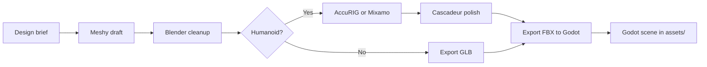

# Asset pipeline

Production workflow for 3D art in Goblin Colony. This document adapts the
deep-research playbook to **this repo's 2.5D grid sim** — movement is tile-based;
character animation is for readability, not freeform navmesh locomotion.

## Tool roles

| Tool | Role | When to use |
|---|---|---|
| **Meshy** | Fast concept and draft 3D generation | Props, room kit pieces, first-pass goblin bodies |
| **Blender** | Canonical cleanup and source authoring | Every shippable asset passes through here |
| **AccuRIG** | Production humanoid auto-rigging | Final reusable goblin body rigs |
| **Mixamo** | Placeholder rig + animation library | Locomotion prototypes, work loops, quick validation |
| **Cascadeur** | Animation polish | Foot contacts, work-loop readability, secondary motion |
| **Godot** | Runtime import and scene assembly | GLB static assets; FBX for animated characters |

## Format policy

| Format | Use | Notes |
|---|---|---|
| `.blend` | Editable source only | Internal working file; not interchange standard |
| `.glb` / `.gltf` | Static runtime assets | Props, furniture, environment kit — **default for static** |
| `.fbx` | Animated character shuttle | AccuRIG → Mixamo/Cascadeur → Godot round-trips |
| `.usd` | Side branches only | AccuRIG/Cascadeur may export USD; Godot does not import USD as primary 3D scene format |
| `.dae` | Fallback only | Legacy interchange if FBX fails |

**Rule:** BLEND is the editable master, GLB is the static runtime asset, FBX is
the animated-character shuttle.

## Pipeline flow



## Meshy presets

| Asset class | Meshy approach | Export |
|---|---|---|
| Props, furniture, tools | Text/Image-to-3D `lowpoly`; refine with PBR if needed | GLB |
| Goblin bodies | Multi-view or `standard` with `pose_mode` A-pose/T-pose; Blender cleanup before rigging | GLB + FBX for rigging pass |
| Environmental clutter | Batch lowpoly drafts; full cleanup only for assets that pass art review | GLB |

Do **not** commit raw Meshy output as final without Blender cleanup.

## Blender cleanup checklist

Before any export:

1. **Scale** — Apply transforms; scale = 1.0, rotation clean.
2. **Origin** — Props: logical placement point. Characters: root/pelvis alignment.
3. **Normals** — Recalculate; inspect hard-edge artifacts.
4. **Topology** — Retopo meshes that will deform or animate.
5. **Materials** — PBR-friendly setups compatible with glTF/FBX export.
6. **Weights** — After rigging, normalize and inspect vertex weights.

Grid sim note: goblins snap to **1 tile = 1 meter** (see `docs/technical-reference.md`).
Character height and footprint should read clearly at that scale.

## Rigging choices

| Tool | Verdict for this project |
|---|---|
| **AccuRIG** | **Production default** for final goblin rigs |
| **Mixamo** | Placeholder locomotion and work-loop prototyping |
| **Meshy auto-rig** | Early prototype only — not production |
| **RigAnything / research tools** | Experimental; non-humanoid creatures only |

Mixamo constraints: humanoid, clean mesh, centered origin, neutral pose, no
extra scene junk. Textured FBX needs embedded media.

Cascadeur: animation workstation only — it does not import materials from FBX.
Treat Godot as the material/lighting authority.

## Godot drop locations

| Content | Path |
|---|---|
| Meshy imports (via plugin) | `assets/meshy/` |
| Static props (GLB) | `assets/props/` |
| Characters (FBX/GLB) | `assets/characters/` |
| Environment | `assets/env/` |
| Placeholder primitives | `assets/placeholder/` |

Reference assets by `uid://` from `.tres` resources. Never hardcode raw
filenames in gameplay code (see `AGENTS.md` §4).

## Goblin scene structure (runtime)

Grid sim uses kinematic tile movement, not `NavigationAgent3D`:

```text
Goblin.tscn
- Node3D                          # grid position drives global_transform
  - Node3D VisualRoot
    - Skeleton3D                  # when rigged assets land
    - MeshInstance3D
    - AnimationPlayer
    - AnimationTree               # optional; for locomotion states
  - Area3D or collision for selection (optional Phase 3+)
```

Movement goes through `scripts/agents/movement_adapter.gd` (`AStarGrid2D`), not
direct pathfinding from animation or UI code.

## Import settings

See `docs/import-settings.md` for Godot importer defaults and deviations.
