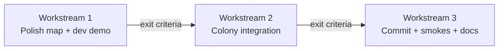

# Sequential Plan — Phase 10, Colony Integration, Stabilize & Ship

**Created:** 2026-07-11  
**Authority:** `docs/goblin-warrens-design.md` (MVP: survive 7 days), `TERRAIN3D_HYBRID_MAP_PLAN.md` Phase 10  
**Order:** Do **Workstream 1 → 2 → 3** only. Do not start integration until Workstream 1 exit criteria pass.

---

## Current state (baseline)

| Item | Status |
| --- | --- |
| Authored map pack | `data/maps/three_lane_swamp_valley/` (350×350 baked layers) |
| Compilers | Grid, foliage, resources, strategic — headless smokes pass |
| Map editor | Goblin Map dock (biome, buildable, start, no-scatter, raid, camp) |
| Dev spikes | Terrain3D movement, Warren placement, grid overlay |
| **Production colony** | **`scenes/colony.tscn` still procgen via `MapGenerator.build()`** |
| Observability | Phase 9 debug commands + overlays |
| Uncommitted work | Phases 4–9 (local changes) |

---

## Workstream 1 — Phase 10: Polished demonstration map

**Goal:** One authored map that is **content-complete**, **compile-clean**, and **playable for 7 days in a dev scene** — without changing production `colony.tscn` yet.

**Exit criteria (all required):**

1. Map passes every authored-map headless smoke (see §Smoke battery).
2. At least **3 distinct valid Warren candidates** with different suitability labels (Defensible / Rich / Exposed, etc.).
3. Raid entries painted and compiled (≥4 entries on reference map already; verify spawn cells feel fair).
4. Resource scatter yields enough gather targets near each viable Warren zone for early game.
5. **7-day dev demo** completable: survive day 7 militia raid using authored spawns (manual playtest log).
6. `docs/technical/PHASE10_DEMO_MAP_REPORT.md` written with test steps and known gaps.

### 1.1 Map content polish (editor — mostly manual)

**Map:** `three_lane_swamp_valley` (or rename in manifest only after bake pipeline re-run).

| Task | Layer / tool | Done when |
| --- | --- | --- |
| Biome readability | `biome` | Wetland, forest, meadow, foothill regions visually distinct in preview |
| Buildable camp space | `buildable` | Each Warren candidate has ≥80 buildable cells within scan radius (Warren controller already checks) |
| Warren choices | `start_zone` | ≥3 ALLOWED clusters, no overlap with FORBIDDEN near intended camps |
| Decorative vs gameplay | `no_scatter` | Roads/clearings blocked for trees; gameplay resources **not** accidentally masked |
| Raid fairness | `raid_entry` | Entries on map edges / logical approach lanes; not inside player start zones |
| Optional camps | `enemy_camp_zone` | At least 1 painted zone for future camp expansion (0 camps OK for MVP if raids suffice) |
| Height sanity | `01_heightmap` | No sheer cliffs blocking main lanes; rebake after sculpt edits |

**Workflow:**

1. Open Goblin Map Editor dock → load map → paint → **Save Source** → **Re-bake 350**.
2. Re-run smokes after each substantive layer change.

### 1.2 Compile & validation gates (automated)

Run after every rebake:

```powershell
$G = "C:\Users\shkin\AppData\Local\Microsoft\WinGet\Packages\GodotEngine.GodotEngine_Microsoft.Winget.Source_8wekyb3d8bbwe\Godot_v4.7-stable_win64_console.exe"

& $G --headless --path . --script tests/smoke/test_semantic_map_import.gd
& $G --headless --path . --script tests/smoke/test_grid_compiler.gd
& $G --headless --path . --script tests/smoke/test_map_definition_smoke.gd
& $G --headless --path . --script tests/smoke/test_foliage_scatter_smoke.gd
& $G --headless --path . --script tests/smoke/test_resource_scatter_smoke.gd
& $G --headless --path . --script tests/smoke/test_warren_placement_smoke.gd
& $G --headless --path . --script tests/smoke/test_strategic_map_smoke.gd
```

**Record baseline numbers** in PHASE10 report (walkable count, resource count, Warren top score, raid count).

### 1.3 Authored demo scene (new code — dev only)

**Do not modify `colony.tscn` in this workstream.**

| Deliverable | Purpose |
| --- | --- |
| `scenes/dev/authored_demo.tscn` | Inherits or duplicates colony layout with authored bootstrap |
| `scripts/dev/authored_demo.gd` | Thin wrapper: Warren pick UI → call authored bootstrap → start 7-day loop |
| `tests/smoke/test_authored_demo_smoke.gd` | Headless: load demo scene, assert grid + resources spawned, exit 0 |

**Demo scene must:**

- Load Terrain3D from `authored_terrain3d_loader.gd`
- Apply compiled grid to `MovementAdapter` (not procgen tile classes)
- Show Warren placement UI (`warren_placement_spike` pattern → in-game panel)
- Spawn storehouse offset from chosen Warren cell
- Scatter resources from `CompiledResourceMap` (placement_id set)
- Pass `CompiledStrategicMap` into `ThreatScheduler.setup()`
- Use existing colony tick loop (reuse `GoblinWarrenColony` via scene inheritance if possible)

**Manual 7-day checklist:**

- [ ] Day 1–2: workers gather wood/stone/food without stuck paths
- [ ] Day 2: beast spawn at authored raid cell (not east edge)
- [ ] Day 6–7: scout + militia from authored entries
- [ ] Warren survives or loss is understandable (not spawn-in-cliff / zero resources)
- [ ] Debug: `inspect_jobs`, `toggle_walkability_overlay` useful on authored grid

### 1.4 Risks & rollback (Workstream 1)

| Risk | Mitigation |
| --- | --- |
| Map too sparse near some Warren picks | Paint resource_affinity + rebake; tune scatter seeds in compiler only if needed |
| Terrain3D editor-only collision | Manual verify in editor; movement uses compiled grid anyway |
| Demo scene duplicates colony logic | Prefer **scene inheritance** from `colony.tscn`; override `_setup_world` only |

**Rollback:** Delete dev demo scene; map pack unchanged; colony unaffected.

---

## Workstream 2 — Colony integration (production path)

**Prerequisite:** Workstream 1 exit criteria signed off (demo playable, smokes green).

**Goal:** `colony.tscn` can boot from **authored map** with player Warren choice, while **procgen remains available as fallback** (project setting or export flag).

**Exit criteria:**

1. Project setting or `MapConfig` flag selects `procgen` vs `authored:three_lane_swamp_valley`.
2. Authored path: Warren pick UI → bootstrap → same 7-day loop as procgen.
3. Raids use compiled strategic entries when authored.
4. Save/load stores `map_id`, `map_version`, `resource_states[]` by `placement_id`.
5. Procgen path unchanged when flag off (existing `test_colony.gd` still passes).
6. New smoke: `test_authored_colony_bootstrap.gd` (headless bootstrap, no full 7-day sim).
7. `docs/technical/COLONY_AUTHORED_MAP_INTEGRATION.md` written.

### 2.1 Architecture (minimal diff)

```
colony.gd _setup_world()
  ├─ if authored mode:
  │    AuthoredColonyBootstrap.build(map_root, chosen_warren_cell)
  │      → CompiledGridMap → MovementAdapter
  │      → Terrain3D (or height field from grid)
  │      → CompiledResourceMap → spawn nodes
  │      → CompiledStrategicMap → ThreatScheduler
  │      → foliage from compiled plan
  └─ else:
       MapGenerator.build()  (unchanged)
```

| New file | Role |
| --- | --- |
| `scripts/world/map/authored_colony_bootstrap.gd` | Single factory: map_root + warren_cell → bootstrap DTO |
| `scripts/ui/warren_pick_panel.gd` + `.tscn` | Pre-game or day-0 Warren selection from ranked candidates |
| `scripts/world/map/authored_map_plan_adapter.gd` | Optional thin `MapPlan`-like view for HUD/debug compat |

**Modify (allowed):**

- `scripts/world/colony.gd` — branch `_setup_world`, spawn from compiled resources
- `scripts/world/threat_scheduler.gd` — already accepts strategic map; wire from colony
- `scripts/save/colony_save_data.gd` — schema v2 fields active
- `scripts/world/colony.gd` `capture_save_data` / `apply_save_data`
- `project.godot` — export var or custom project setting `game/map_mode`

**Forbidden without explicit approval:**

- Rewriting `JobService` or gather-return-store loop
- Refactoring frozen `baked_grid_compile.gd` boundary (use `grid_compiler.gd` path)
- Removing procgen default until user flips flag

### 2.2 Integration tasks (ordered)

| Step | Task | Verify |
| --- | --- | --- |
| 2.2.1 | Add `map_mode` project setting (`procgen` / `authored`) | Default `procgen`; colony unchanged |
| 2.2.2 | Extract authored bootstrap from dev demo into `authored_colony_bootstrap.gd` | Unit-style smoke loads bootstrap DTO |
| 2.2.3 | Warren pick UI (reuse `WarrenPlacementController` ranked list) | Pick cell → bootstrap receives it |
| 2.2.4 | Wire movement + height from compiled grid | Goblins path on authored walkability |
| 2.2.5 | Wire resource spawn from `CompiledResourceMap` | `placement_id` on nodes; gather works |
| 2.2.6 | Wire foliage + Terrain3D visual | Grass visible; perf acceptable |
| 2.2.7 | Wire `ThreatScheduler` + `spawn_enemy(..., cell)` | Day 2/6/7 raids at painted entries |
| 2.2.8 | Save schema v2: map_id, map_version, resource_states | Save mid-game, reload, resources correct |
| 2.2.9 | HUD/debug: map mode line, authored overlay uses compiled grid | `inspect_goblin` works on authored map |
| 2.2.10 | Merge dev demo into colony OR delete dev demo if redundant | One bootstrap code path |

### 2.3 Tests

| Test | When |
| --- | --- |
| `test_colony.gd` | Must pass with `map_mode=procgen` |
| `test_authored_colony_bootstrap.gd` (new) | Authored bootstrap: grid, N resources, strategic raids |
| Full smoke battery | After integration merge |
| Manual 7-day on **colony.tscn** authored mode | Same checklist as Workstream 1.3 |

### 2.4 Risks & rollback (Workstream 2)

| Risk | Mitigation |
| --- | --- |
| Dual terrain (CSG mesh vs Terrain3D) | Hide procgen mesh in authored mode; one visual authority |
| MapPlan-dependent debug HUD breaks | Adapter returns width/height/warren_cell for HUD |
| Save v1 breaks | Bump `schema_version`; v1 loads procgen only |
| 350×350 vs Constants.GRID_WIDTH drift | Bootstrap sets movement bounds from compiled grid |

**Rollback:** Set `map_mode=procgen`; authored code paths dormant.

---

## Workstream 3 — Stabilize & ship

**Prerequisite:** Workstream 2 exit criteria pass.

**Goal:** Clean git history, documented handoff, repeatable CI smoke script, no known regressions.

### 3.1 Git commits (suggested split)

| Commit | Contents |
| --- | --- |
| 1 | `feat(map): phases 4–9 authored pipeline + observability` |
| 2 | `feat(map): phase 10 demo map content + dev demo scene` (includes map PNG updates if any) |
| 3 | `feat(colony): authored map bootstrap + warren pick + save v2` |
| 4 | `docs: phase reports, integration guide, HANDOFF update` |

User approves each commit explicitly before push.

### 3.2 Smoke battery (single script)

Add `tools/run_all_smokes.ps1` (or `tests/smoke/run_all.gd` orchestrator):

1. `test_smoke.gd`
2. `test_colony.gd` (procgen)
3. All authored-map smokes (grid → observability)
4. `test_authored_colony_bootstrap.gd` (new, authored)
5. `test_mapgen.gd`

Document expected runtime (~2–5 min total; warren placement ~30s).

### 3.3 Documentation updates

| File | Update |
| --- | --- |
| `HANDOFF.md` | Current phase, map_mode flag, how to play authored vs procgen |
| `data/maps/three_lane_swamp_valley/README.md` | Phase 10 complete, colony integration notes |
| `docs/technical-reference.md` | New scenes, smokes, project settings |
| `docs/technical/PHASE10_DEMO_MAP_REPORT.md` | Workstream 1 deliverable |
| `docs/technical/COLONY_AUTHORED_MAP_INTEGRATION.md` | Workstream 2 deliverable |

### 3.4 Manual regression (before tag / demo build)

- [ ] Procgen colony: 7-day loop (baseline)
- [ ] Authored colony: Warren pick → 7-day loop
- [ ] Save/load mid-authored-game
- [ ] Debug console commands on both modes
- [ ] Editor: Goblin Map dock load/save/rebake
- [ ] No new gameplay autoloads

### 3.5 Out of scope for Workstream 3

- Windows export preset (still blocked per Phase 1 spike)
- Landmark layer / enemy camp spawning logic
- NavigationAgent3D migration
- Underground anything

---

## Timeline & decision points



**Stop / ask user before:**

- Flipping default `map_mode` from procgen to authored
- Deleting procgen path
- Any JobService or worker-loop rewrite
- Committing or pushing to remote

---

## What to do next (immediate)

**Workstreams 1–3 are complete** (commits pending your approval).

To ship:
1. Say **"commit"** — I'll create the 4 logical commits from `WORKSTREAM3_STABILIZE_REPORT.md`
2. Manual authored 7-day playtest in editor (`map_mode=authored`)

---

## Acceptance template (per workstream)

Use design doc §38 after each workstream:

- Files changed / added
- Behavior preserved
- How to test
- Limitations
- Next step
