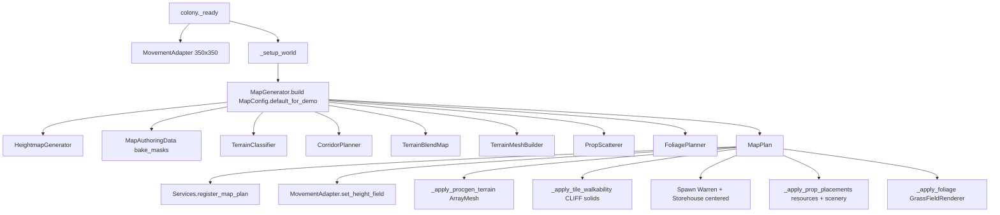
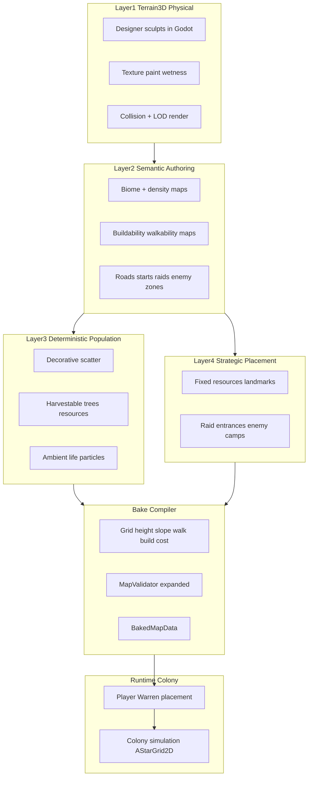

# Terrain3D Hybrid Map and Colony Simulation Plan

**Status:** Phase 0 complete (this document); Phase 1 compatibility spike in progress  
**Owner:** Cursor + project owner  
**Last updated:** 2026-07-10  
**Design authority:** `docs/goblin-warrens-design.md` §5 (single above-ground map)  
**Supersedes direction in:** `docs/procedural-map-plan.md` for *future* map development (that doc remains the authority for the **current shipped** procgen pipeline until migration phases complete)

---

## Purpose

The runtime procedural generator has become too responsible for strategic map composition, visual quality, resource fairness, biome identity, pathing, and settlement suitability. It should no longer be expected to invent the complete playable world.

The new direction:

> **Author the terrain and strategic geography, paint semantic biome and gameplay intent, use deterministic procedural systems to populate those authored areas, and allow the player to choose where to establish the Warren within validated terrain.**

This is **not** permission to delete the current map pipeline or rewrite the whole project. Refactor incrementally and preserve working gameplay.

---

## 1. Current map pipeline

### 1.1 Runtime flow

Production path: `scenes/colony.tscn` → `GoblinWarrenColony._ready()` → `_setup_world()`.



### 1.2 File ownership table

| Path | Role |
|------|------|
| `scenes/colony.tscn` | Main playable scene; legacy `Ground` CSG 350×350 hidden at runtime |
| `scripts/world/colony.gd` | World bootstrap: generate → apply terrain/walkability/props/foliage → spawn Warren |
| `scripts/world/mapgen/map_generator.gd` | Procgen orchestrator |
| `scripts/world/mapgen/map_plan.gd` | Generated map DTO |
| `data/mapgen/map_config.gd` | Tunable gen params; `default_for_demo()` seed 424242 |
| `data/mapgen/map_authoring_data.gd` | Stamp-based composition masks (clearing, roads, forests, pockets) |
| `data/mapgen/demo_map_authoring.tres` | Baked authoring resource (tool output; not loaded at runtime unless assigned) |
| `scripts/world/mapgen/heightmap.gd` | Noise + valley/camp flattening |
| `scripts/world/mapgen/valley_terrain.gd` | Valley/ridge/expansion-ring scores |
| `scripts/world/mapgen/terrain_classifier.gd` | Per-tile class + walkable/buildable helpers |
| `scripts/world/mapgen/corridor_planner.gd` | Raid lane + footpath metadata |
| `scripts/world/mapgen/terrain_mesh.gd` | Heightmap → `ArrayMesh` |
| `scripts/world/mapgen/terrain_blend_map.gd` | Class transition blend texture |
| `scripts/world/mapgen/terrain_material.gd` | 7-class macro texture shader material |
| `data/mapgen/terrain_palette.gd` | Texture paths per `Defs.TerrainClass` |
| `scripts/world/mapgen/prop_scatterer.gd` | Trees, rocks, dressing, resources, border ring |
| `scripts/world/mapgen/prop_placement.gd` | One scatter entry DTO |
| `scripts/world/mapgen/height_sampler.gd` | Bilinear height from `MapPlan` |
| `scripts/world/mapgen/map_rng.gd` | Seeded RNG |
| `scripts/world/mapgen/map_validator.gd` | Debug validation |
| `scripts/world/foliage/foliage_planner.gd` | Grass chunk + ambient zone planning |
| `scripts/world/foliage/grass_field_renderer.gd` | MultiMesh grass near camp |
| `scripts/world/foliage/ambient_life_spawner.gd` | Fireflies/butterflies/gnats/spores |
| `scripts/agents/movement_adapter.gd` | `AStarGrid2D` + height sampling |
| `scripts/world/placement_validator.gd` | Building footprint = walkability only |
| `scripts/core/constants.gd` | `GRID_WIDTH/HEIGHT` = 350, mapgen noise, foliage budgets |
| `scripts/core/services.gd` | Registers `map_plan`, `movement` |
| `scripts/art/visual_catalog.gd` | Prop scene paths + scales for scatter |
| `scripts/world/environment_dresser.gd` | **Deprecated** — not called |
| `scripts/save/colony_save.gd` | Thin goblin-only save |
| `scripts/world/threat_scheduler.gd` | Day-based raids |
| `docs/procedural-map-plan.md` | Current procgen architecture authority |

### 1.3 Generator stages

| Stage | Module | Output |
|-------|--------|--------|
| 0 | `map_generator.gd` | Config + centered `warren_cell`, `storehouse_cell` |
| 1 | `map_authoring_data.gd` | Clearing/road/forest/resource stamps → baked masks |
| 2 | `heightmap.gd` | `(width+1)×(height+1)` float height grid |
| 3 | `valley_terrain.gd` | `height_min`, `height_max` on plan |
| 4 | `terrain_classifier.gd` | 7-class grid per tile |
| 5 | `corridor_planner.gd` | Raid lane + footpaths; repaints cells |
| 6 | `terrain_blend_map.gd` | Per-cell blend texture for shader |
| 7 | `terrain_mesh.gd` | `ArrayMesh` with vertex colors encoding class |
| 8 | `prop_scatterer.gd` | `prop_placements[]`, `scatter_stats` |
| 9 | `foliage_planner.gd` | `foliage_plan` (grass chunks + ambient zones) |

Single implicit biome: **Goblin Forest Valley**. No `biome_def.gd` / `biome_catalog.gd` files exist despite being listed in older docs.

### 1.4 Stage classification

| Component | Classification | Rationale |
|-----------|----------------|-----------|
| `MapGenerator` + `MapPlan` | **Retain and adapt** | Clean orchestration boundary; becomes bake compiler later |
| `HeightmapGenerator` | **Replace with Terrain3D** (physical layer) | Designer-authored landforms |
| `TerrainMeshBuilder` + macro shader | **Replace with Terrain3D** (rendering) | Terrain3D owns mesh/LOD/textures |
| `TerrainClassifier` | **Adapt → bake-time** | Rules compile to grid walk/build/cost from height + semantic paint |
| `MapAuthoringData` stamps | **Move to editor tooling** | Evolve into semantic painter |
| `CorridorPlanner` | **Adapt → bake-time + manual** | Raid routes become authored + validated |
| `PropScatterer` | **Adapt → bake-time** | Obey semantic layers + seeds |
| `FoliagePlanner` + grass renderer | **Retain and adapt** | Decorative vs gameplay split |
| `MapValidator` | **Retain and expand** | Pre-play gate for baked maps |
| `EnvironmentDresser` | **Deprecate** | Dead code path |
| `MovementAdapter` | **Retain and adapt** | Instance dimensions; grid from baked data |
| Legacy `Ground` CSG | **Deprecate** | Hidden at runtime |
| `biome_def` / `biome_catalog` (planned) | **Replace** | Never implemented; use `BiomeProfile` Resources |

### 1.5 Doc ↔ code conflicts (report before changing behavior)

| Topic | Docs say | Code does |
|-------|----------|-----------|
| Map size in noise defaults | 32×32, 4 m height (`procedural-map-plan.md` §8) | **350×350**, **11 m** (`constants.gd`) |
| `biome_def.gd`, `biome_catalog.gd` | Listed in module table | **Files do not exist** |
| `prop_scatterer` | "Inlined; separate file removed" | **`prop_scatterer.gd` exists and is used** |
| Buildability | `PlacementValidator` checks `is_buildable` | **Only walkability checked** |
| `ROCKY_SLOPE` | Slow movement | **Full speed** (only CLIFF blocked) |
| Enemy spawn | Corridor endpoints | **`spawn_enemy()` at east edge `GRID_WIDTH - 2`** |
| F6 / `dev_regen_map` | Phase 5 pending | **Not implemented** |
| `third-party-tools.md` | SKIP Terrain3D | **Pivot approved — spike in progress** |
| Save | Colony persistence | **Goblin cells/needs only** — map always regenerates |

---

## 2. Proposed target pipeline



**Order of authority:**

```text
Designer authors landform
        ↓
Designer paints biome and gameplay intent
        ↓
Designer places strategic exceptions
        ↓
Seeded tools populate ecological detail
        ↓
Compiler creates grid and runtime data
        ↓
Validator rejects broken maps
        ↓
Player chooses where to establish the Warren
        ↓
Colony simulation begins
```

---

## 3. Terrain3D ownership boundaries

### Terrain3D owns

- Terrain height, geometry, rendering, LOD, collision
- Surface texture painting, visual wetness
- Large-scale landforms; editor-time terrain changes
- Decorative instancing via its supported API

### Terrain3D must NOT become

- Job system, colony grid, building validator, pathfinding authority
- Resource state authority, save-game authority, raid planner
- Warren placement authority

### Goblin Warrens owns

- `AStarGrid2D` via `movement_adapter.gd` (1 logical tile = 1 meter)
- Building placement validation (walkable **and** buildable)
- Resource depletion, worker jobs, combat, raids, colony save deltas

### Narrow adapter (Phase 2)

```text
TerrainSurfaceAdapter
  get_world_height(world_position)
  get_world_normal(world_position)
  get_world_slope(world_position)
  is_world_position_on_terrain(world_position)
  sample_grid_cell_height(cell)
  sample_grid_cell_slope(cell)
  project_to_terrain(world_position)
  get_terrain_texture_data(world_position)  # visual only, not biome ID
```

Gameplay code depends on the adapter or compiled `BakedMapData`, not Terrain3D internals.

---

## 4. Logical grid integration

For every logical cell `(x, y)` compile:

```text
center_height
corner_heights (if needed for footprint slope checks)
surface_normal
slope_degrees
walkability
buildability
terrain_movement_cost
hard_blocker_state
biome_id
resource_affinity
start_zone_eligibility
```

### Walkability sources

- Excessive slope, water, cliff
- Explicit painted blocker
- Hard prop, building, gameplay tree, resource node
- Reserved landmark, map boundary

### Buildability (separate from walkability)

A cell may be walkable but not buildable: too steep, uneven, on a road, in a raid corridor, protected biome, water clearance, under a resource, near a landmark, exclusion zone, enemy camp reservation, bridge/narrow pass.

**Current gap:** `PlacementValidator.is_footprint_clear()` only checks `movement.is_walkable()`. Migration must wire `is_buildable()` and baked buildability maps.

### Map-size fix (Phase 2+)

`MovementAdapter.is_in_bounds()` hardcodes `Constants.GRID_WIDTH/HEIGHT`. Must use instance/map dimensions from `BakedMapData` or `GoblinMapDefinition`.

Affected: `rts_camera.gd`, `spawn_enemy()`, `food_spawner.gd`, `world_ray.gd` (flat y=0 plane).

---

## 5. Semantic-layer storage format

Terrain texture and biome meaning **must remain separate**. Mud may appear in wetlands, roads, Warren areas, farms, battlefields — do not infer biome from Terrain3D texture IDs.

### Required semantic layers

Stored as `Image` (R8 or R8G8 per layer) or typed sub-Resources referenced by `GoblinMapDefinition`:

```text
biome_map              # uint8 biome_id per cell
foliage_density_map    # 0-255 density
buildability_map       # enum: buildable / unbuildable / override
walkability_override_map
movement_blocker_map
resource_affinity_map  # uint8 affinity pocket type
start_zone_map         # allowed / forbidden / neutral
no_scatter_map
road_clearance_map
raid_entry_map
enemy_camp_zone_map
landmark_exclusion_map
```

**Storage location:** `data/maps/<map_id>/semantic/` as `.res` or PNG sidecars; referenced from `GoblinMapDefinition`.

**Resolution:** 1 pixel = 1 logical meter (matches grid).

---

## 6. Proposed typed Resources

All under `data/maps/` and `scripts/world/map/` (new, Phase 3+):

### `GoblinMapDefinition` (`goblin_map_definition.gd`)

```text
map_id, display_name, map_version, map_seed
terrain_data_reference      # Terrain3D region path
map_width, map_height
biome_layer_reference
density_layer_reference
buildability_layer_reference
walkability_override_reference
resource_affinity_reference
start_zone_reference
no_scatter_reference
road_layer_reference
fixed_resource_placements: Array[FixedMapPlacement]
fixed_prop_placements
fixed_landmarks
raid_entrances, raid_routes
enemy_camp_zones, ambient_zones
validation_profile: MapValidationProfile
seed channels (foliage, harvestable, resource, ambient, enemy, clutter)
```

### `BiomeProfile` (`biome_profile.gd`)

Initial four: Wetland, Temperate Forest, Pine Foothills, Meadow.  
Later: Dense Forest, Rocky Uplands, Mushroom Grove, Dead Forest, Corrupted Ground.

Fields: height/slope ranges, moisture preference, tree/clutter density, spacing, decorative/harvestable species lists, ambient effects, road/building clearance, resource affinities.

### `ScatterEntry`, `ResourcePlacementRule`, `FixedMapPlacement`, `MapValidationProfile`, `BakedMapData`

As specified in the planning directive §5–6. `BakedMapData` is the runtime-oriented compile output registered via `Services` (replacing raw `MapPlan` over time, with adapter period where both coexist).

---

## 7. Save/load implications

### Static authored data (map definition / bake)

Terrain, biomes, roads, fixed placements, procedural spawn records, initial resource IDs, enemy site definitions, raid entrances.

### Runtime mutable data (colony save)

Warren placement, starting location, depleted resources, removed trees, destroyed props, constructed buildings, changed blockers, fog discovery, enemy camp state, active raids, map seed/version reference.

**Do not** save Terrain3D full terrain data inside every colony save.

**Current state:** `ColonySaveData` v1 stores only `tick`, `goblin_cells`, `goblin_hunger`, `goblin_energy`. `ColonySave.load()` is never called from `_ready()`. Map always regenerates on start.

**Migration requirement:** Colony save must reference `map_id` + `map_version` + `warren_cell` + runtime deltas. Resource nodes need stable IDs (`placement_id` from bake).

---

## 8. Warren placement changes

### Current behavior

Warren always at map center: `_centered_warren_cell()` in `map_generator.gd`. Camp flattening, buildable core, initial goblin spawn, and foliage radius all assume this.

### Target flow

```text
Load baked map
Reveal initial survey information
Enter Establish the Warren mode
Display valid placement regions
Player previews candidate location
Player confirms Warren placement
Spawn Warren + starting goblins + initial supplies
Reveal initial fog radius
Initialize colony search origins
Begin normal game
```

### Validation checks

Flat footprint, acceptable slope, continuous buildable area, multiple walkable exits, no water/hard blockers/protected roads/major resources/enemy camps/raid entrances/landmarks, minimum border distance.

### Suitability scoring (baked)

Nearby buildable area, food/wood/stone/rare resources by travel range, defensibility, approach directions, threat distance, terrain cost, expansion room. UI labels: Poor / Acceptable / Good / Rich / Dangerous / Defensible / Exposed.

**Do not** regenerate major resources after Warren placement. Small emergency guarantee for basic wood/food/stone only.

---

## 9. Resource placement model

| Mode | Use | Never moved by regen |
|------|-----|----------------------|
| **Fixed placement** | Major iron, rare gold/scrap, tutorial food, special groves, landmarks | Yes — `locked = true` |
| **Painted pocket** | Iron pocket, stone-rich, mushroom-rich, food-rich wetland, dense timber, scrap ruins | N/A — compiler places range inside zone |
| **Rule-generated** | Biome/height/slope rules with target counts | Regenerable on rebake unless locked |

All generated nodes: reachability, grid footprint, spacing, valid biome/slope/height, no building overlap, no route obstruction.

**Decorative vs gameplay:** Decorative vegetation (grass, small ferns, distant fillers) — no save state, no pathfinding blockers, no jobs. Gameplay vegetation (harvestable trees, deposits, berry bushes) — stable IDs, depletion, selection, grid footprints, job integration.

---

## 10. Procedural seed strategy

Independent seed channels:

```text
foliage_seed, harvestable_seed, resource_seed
ambient_seed, enemy_seed, clutter_seed
```

Same `GoblinMapDefinition` + profiles + seeds → same output.

Support: full-map rebake, selected-zone rebake, single-layer rebake, preserve locked placements, preview with temporary seed, commit/restore.

---

## 11. Validation strategy

A baked map is rejected if:

- Terrain/grid samples invalid; slopes inconsistent
- No valid Warren regions; core regions unreachable
- Minimum food/wood/stone not satisfied
- Raid entrances do not connect to settlement regions
- Fixed placements moved or overlapping
- Roads/building areas/start zones violated by scatter
- Runtime save references broken map version

Extend existing `MapValidator` rather than replacing it.

---

## 12. Debug-tool strategy (Phase 9, before simulation expansion)

### Goblin debug inspector

State, job, priority, reservation, source/destination, travel cost, path length, carried resource, needs, interruption reason, idle reason.

### Colony job inspector

Available/reserved/active/blocked/unreachable jobs, workers without jobs, travel/productive time averages.

### Required overlays

Logical grid, walkability, buildability, biomes, resource affinity, start suitability, paths, reserved resources, job lines, blocked cells, connectivity islands, work zones, raid routes, travel-time heat map, scatter preview.

Existing debug console commands (`print_mapgen_status`, composition overlay) remain until replaced.

---

## 13. Compatibility spike checklist (Phase 1)

| # | Test | Result |
|---|------|--------|
| 1 | Install Terrain3D v1.0.2-stable | See §14 spike report |
| 2 | Open project in Godot 4.7 | |
| 3 | Create terrain | |
| 4 | Sculpt terrain | |
| 5 | Paint textures | |
| 6 | Save project | |
| 7 | Restart Godot | |
| 8 | Terrain reloads correctly | |
| 9 | Terrain collision | |
| 10 | Query height from GDScript | |
| 11 | Query slope and normal from GDScript | |
| 12 | Decorative transforms via instancer API | |
| 13 | Save/reload instancer data | |
| 14 | Run existing colony scene unchanged | |
| 15 | Headless smoke tests pass | |
| 16 | Windows development export | |
| 17 | Exported terrain loads + collision | |
| 18 | Profile editor/runtime memory | |
| 19 | Record plugin version and source | |
| 20 | Update THIRD_PARTY_LICENSES.md | |

**Godot 4.7 note:** Terrain3D v1.0.2-stable officially supports Godot 4.4–4.6+. Spike must prove 4.7; do not downgrade Godot on failure.

---

## 14. Phase 1 spike report

**Date:** 2026-07-10  
**Godot:** 4.7.stable.official  
**Terrain3D:** v1.0.2-stable (MIT)  
**Source:** https://github.com/TokisanGames/Terrain3D/releases/tag/v1.0.2-stable  
**Install:** `res://addons/terrain_3d/`  
**Spike scene:** `res://scenes/dev/terrain3d_compat_spike.tscn`  
**Headless test:** `tests/smoke/test_terrain3d_spike.gd`

| # | Test | Result | Notes |
|---|------|--------|-------|
| 1 | Install Terrain3D v1.0.2-stable | **PASS** | Extracted to `addons/terrain_3d/`; plugin enabled |
| 2 | Open project in Godot 4.7 | **PASS** | Project loads; colony scene runs |
| 3 | Create terrain | **PASS** | Programmatic 256×256 height region in spike |
| 4 | Sculpt terrain | **MANUAL** | Use editor on spike scene — not automated |
| 5 | Paint textures | **MANUAL** | Use Terrain3D editor tools — not automated |
| 6 | Save project | **PASS** | Region saved to `data/dev/terrain3d_spike/terrain_data/` |
| 7 | Restart Godot | **MANUAL** | Recommended editor verification |
| 8 | Terrain reloads correctly | **PASS** | `load_directory()` after save in headless test |
| 9 | Terrain collision | **PARTIAL** | Raycast failed headless; verify in editor (Debug → Visible Collision Shapes) |
| 10 | Query height from GDScript | **PASS** | `terrain.data.get_height()` at map center |
| 11 | Query slope and normal | **PASS** | `get_normal()` + slope calc (~0.07° at center) |
| 12 | Instancer API | **PASS** | `Terrain3DAssets` + `Terrain3DMeshAsset` assigned |
| 13 | Save/reload instancer data | **MANUAL** | Instancer assets assigned; full instancer bake not in spike |
| 14 | Colony scene unchanged | **PASS** | `scenes/colony.tscn` headless run exit 0 |
| 15 | Headless smoke tests | **PASS** | `test_smoke.gd`, `test_mapgen.gd`, `test_terrain3d_spike.gd` all exit 0 |
| 16 | Windows development export | **BLOCKED** | No `export_presets.cfg` in repo — manual preset required |
| 17 | Exported terrain loads | **NOT RUN** | Blocked on export preset |
| 18 | Profile memory | **NOT RUN** | Defer to editor profiler during manual review |
| 19 | Plugin version recorded | **PASS** | See above; license in `THIRD_PARTY_LICENSES.md` |
| 20 | License doc updated | **PASS** | Terrain3D entry added |

**Verdict:** Terrain3D **loads and functions on Godot 4.7** for height/normal queries, region save/reload, and instancer asset setup. Collision raycast and sculpt/paint workflows require **manual editor verification**. Export test blocked until export preset exists.

**Rollback:** Disable `res://addons/terrain_3d/plugin.cfg` in `project.godot`; delete `scenes/dev/terrain3d_compat_spike.tscn` and spike data under `data/dev/terrain3d_spike/`. Colony procgen remains production path.

---

## 15. File-by-file implementation phases

### Phase 0 — Repository audit (this document)

**Deliverable:** `docs/technical/TERRAIN3D_HYBRID_MAP_PLAN.md`

### Phase 1 — Terrain3D compatibility spike

| Action | Files |
|--------|-------|
| Install plugin | `addons/terrain_3d/` |
| Enable plugin | `project.godot` |
| License | `docs/legal/THIRD_PARTY_LICENSES.md` |
| Spike scene | `scenes/dev/terrain3d_compat_spike.tscn`, `scripts/dev/terrain3d_compat_spike.gd` |
| Spike data | `data/dev/terrain3d_spike/` (terrain region storage) |
| Docs | `docs/third-party-tools.md`, `docs/technical-reference.md` |

**Do not modify:** `colony.tscn`, `map_generator.gd`, `Services` map registration.

### Phase 2 — Terrain surface adapter + grid sampling

| New | `scripts/world/terrain/terrain_surface_adapter.gd` |
| New | `scripts/world/map/grid_compiler.gd` |
| Modify | `movement_adapter.gd` — instance bounds |
| New | Debug grid overlay under `scripts/world/map/debug/` |
| Test | Small test map; goblins move on AStarGrid2D over Terrain3D heights |

### Phase 3 — Map definition and bake data

| New | `data/maps/goblin_map_definition.gd`, `biome_profile.gd`, `resource_placement_rule.gd`, `baked_map_data.gd`, `map_validation_profile.gd`, `fixed_map_placement.gd`, `scatter_entry.gd` |
| New | `tests/unit/test_map_definition.gd`, `tests/unit/test_baked_map_data.gd` |

### Phase 4 — Minimal semantic painter

| New | `addons/goblin_map_editor/` plugin with dock sections per directive §11 |
| Initial layers | Biome, buildable, start allowed/forbidden, no-scatter |

### Phase 5 — Deterministic foliage population

| Adapt | `foliage_planner.gd`, new `decorative_scatter_compiler.gd` |
| Obey | Semantic masks, independent seeds, zone rebake |

### Phase 6 — Gameplay trees and resource rules

| Adapt | `prop_scatterer.gd` → bake-time resource compiler |
| New | Stable `placement_id` on resource nodes |
| Modify | `resource_node.gd`, `tree_resource.gd` — save support |

### Phase 7 — Player-selected Warren

| Modify | `colony.gd`, `map_generator.gd` (remove auto-center), new Warren placement UI |
| New | `scripts/world/warren_placement_controller.gd`, suitability overlay |

### Phase 8 — Strategic map authoring

| New | Raid entrance, enemy camp, landmark placement modes in map editor |
| Modify | `threat_scheduler.gd`, `colony.spawn_enemy()` — use compiled raid entries |

### Phase 9 — Colony observability

| New | Goblin inspector, job inspector, reservation/path overlays |
| Extend | `game/integrations/debug_console/register.gd` |

### Phase 10 — One polished demonstration map

Single map: wetland + temperate forest + pine foothills + meadow, multiple valid Warren choices, seven-day playable.

---

## 16. Risks and rollback plan

| Risk | Mitigation |
|------|------------|
| Terrain3D fails on Godot 4.7 | Document errors; keep procgen; disable plugin |
| Dual height sources diverge | Single compile step; adapter only at bake/query |
| Grid not updated after terrain edit | Explicit rebake pipeline; no runtime sculpt |
| Fixed 350×350 assumptions | Phase 2 dimension pass |
| Thin save incompatible with baked maps | Phase 6–7 save schema v2 |
| Buildability gap causes bad placement | Wire `is_buildable` before Warren placement UI |
| Resource identity by grid cell only | Add `placement_id` before save expansion |
| Performance: one Node3D per grass blade | Keep MultiMesh decorative path |

**Rollback:** Disable Terrain3D plugin in `project.godot`; delete `scenes/dev/terrain3d_compat_spike.tscn`; production continues on `MapGenerator.build()`.

---

## 17. Explicit systems that remain unchanged (during Phases 0–1)

- Gather → carry → storehouse worker loop
- `JobService` task assignment (no lifecycle rewrite yet)
- Building placement and construction flow (unchanged until buildability wired)
- Food upkeep, housing, Foblins, combat, shrine/magic, burial/revival
- `AStarGrid2D` + `movement_adapter.gd` as movement authority
- Existing resources, raids schedule (east-edge spawn until Phase 8)
- Debug console, smoke tests, GUT tests
- No underground mechanics
- No NavigationAgent3D / navmesh migration

---

## Colony AI and simulation notes (future phases)

Per directive §16–18: explicit job lifecycles, two-stage path assignment (cheap estimate → exact AStar), staggered simulation ticks, event-driven invalidation. **Do not implement during Phase 0–1.** Observability (Phase 9) precedes broad simulation expansion.

---

## What not to build during this pivot

Infinite random worlds, runtime terrain generation/deformation, player terrain sculpting, underground layers, navmesh migration, multiplayer map sync, complex climate, dynamic rivers, dozens of biomes, procedural road networks, Steam Workshop, player-facing map editor.

---

## Cursor work protocol

For every phase: inspect code → state current/proposed behavior → list files → risks → smallest change → preserve fallback → smoke tests → report limitations → update docs → no commit unless requested.

---

## Related documents

- `docs/goblin-warrens-design.md` — design authority
- `docs/procedural-map-plan.md` — current shipped procgen (historical)
- `docs/terrain-texture-brief.md` — macro texture strategy (current renderer)
- `docs/third-party-tools.md` — plugin policy
- `docs/asset-library-acquisition.md` — install workflow
- `AGENTS.md` — engineering contract
